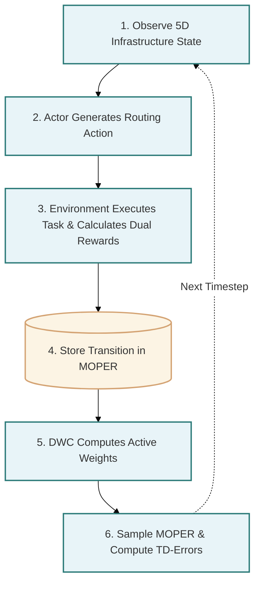

```mermaid
%%{init: {'theme': 'base', 'themeVariables': { 'primaryColor': '#ffffff', 'primaryBorderColor': '#333333', 'clusterBkg': '#f9f9f9', 'clusterBorder': '#666666'}, 'flowchart': {'padding': 20}}}%%
graph TD
    classDef process fill:#e8f4f8,stroke:#2b7a78,stroke-width:2px;
    classDef storage fill:#fcf4e4,stroke:#d4a373,stroke-width:2px;

    S1[1. Observe 5D Infrastructure State]:::process --> S2[2. Actor Generates Routing Action]:::process
    S2 --> S3[3. Environment Executes Task & Calculates Dual Rewards]:::process
    S3 --> S4[(4. Store Transition in MOPER)]:::storage
    S4 --> S5[5. DWC Computes Active Weights]:::process
    S5 --> S6[6. Sample MOPER & Compute TD-Errors]:::process
    S6 -.-> |Next Timestep| S1
```